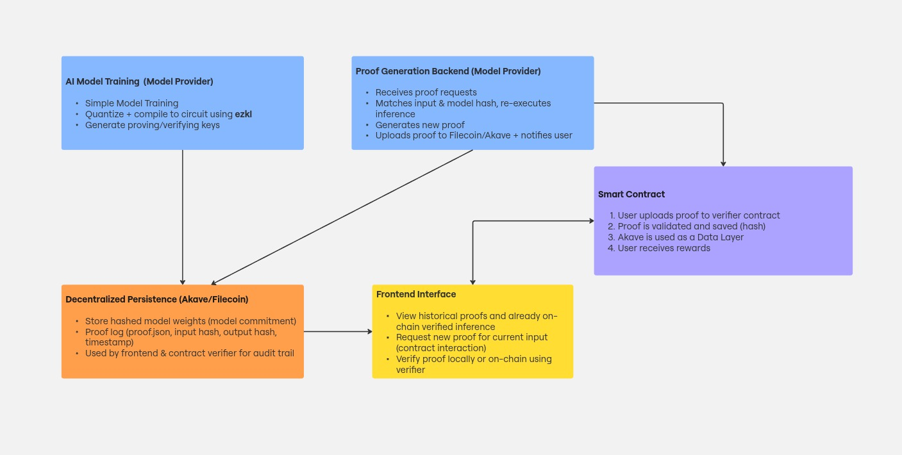

# zkML Proof Marketplace - ETHGlobal Prague 2025

## Overview

This project is a decentralized marketplace for Zero-Knowledge Machine Learning (zkML) proofs. It enables users to request, verify, and pay for cryptographic proofs of model inferences, using decentralized storage and smart contracts for persistence and escrow. Designed for ETHGlobal Prague 2025, it leverages cutting-edge technologies like Filecoin, Akave, Hedera smart contracts and Flow EVM smart contracts to provide trustless, auditable, and privacy-preserving ML proof generation and verification.

## Key Components

### 1. AI Model Training (Model Provider)

- **Train a Machine Learning Model**: Simple model architectures are supported.
- **Quantize & Compile**: Models are quantized and compiled into zk-SNARK circuits using [ezkl](https://github.com/zkonduit/ezkl).
- **Key Generation**: Generates proving and verifying keys required for zero-knowledge proof generation and verification.

### 2. Proof Generation Backend (Model Provider)

- **Request Handling**: Receives proof requests from users.
- **Inference Matching**: Matches input and model hash, re-executes model inference.
- **Proof Generation**: Generates a new zkML proof.
- **Persistence & Notification**: Uploads the proof to Filecoin/Akave and notifies the user.
- **Sharing and rewards**: The user has now the option to verify the proof by a smart contract, making it available for the public and receiving rewards.

### 3. Decentralized Persistence (Akave/Filecoin)

- **Model Commitment**: Stores hashed model weights (commitment).
- **Proof Logs**: Stores proof logs (`proof.json`), input/output hashes, and timestamps.
- **Audit Trail**: Enables both the frontend and contract verifier to audit and trace proofs and model commitments.

### 4. Smart Contract: "Proof verification and rewards"

- **Proof verification**: Users can upload their received proof to get it verified.
- **Aggregation**: Proofs can be aggregated to build benchmarks. 
- **Rewards**: 
  - Users providing proofs get rewarded.

### 5. Frontend Interface

- **Historical Proofs**: View all past proofs and their status.
- **Proof Requests**: Request new proofs for current inputs.
- **Verification**: Verify proofs locally or on-chain using the verifier.

---

## Usage

1. **Model providers** train and upload their models, then generate and upload proving/verifying keys.
2. **Users** request proofs for inputs.
3. **Proof Backend** processes the request, generates a proof, and uploads it to decentralized storage.
4. The **smart contract** manages rewards and does proof verification.
5. **Frontend** allows for proof requests, historical generated proofs and their status on-chain. 

---
## Use-cases

1. ***Honest ML infernce*** Users can be assured that the model they payed for generated the inference.
2. ***Comparability*** Outputs from the same model can be compared and shared with the public.
3. ***Benchmarks*** By gathering enough proofs Benchmarks can be created that reflect the real strength of the Model.
---

## Tech Stack

- **Flow EVM**: Smart contracts for proof verification and rewards.
- **Hedera**: Smart contracts for proof verification and rewards.
- **Filecoin/Akave**: Decentralized storage for models, proofs, and logs.
- **ezkl**: Quantization and zkML circuit compilation.
- **Frontend**: React/Next.js (assumed; adapt as appropriate for your codebase).
- **Backend**: Node.js/Python for proof orchestration (adapt as appropriate for your codebase).

---

## Architecture

See the diagram above for a high-level overview of the system architecture and component interactions.

- testnet (Flow): 0xF5C3c9058F3A6adD15066054116DA13B914351fd (https://evm-testnet.flowscan.io/address/0xF5C3c9058F3A6adD15066054116DA13B914351fd)
- testnet (Hedera): 0x6E3419d936bb7126900ecE3496e02397c0EDB9E1 (https://hashscan.io/testnet/contract/0.0.6094088?ps=1&pf=1&pr=1&pa=1)
---

## Getting Started

1. **Clone the repository**
2. **Install dependencies** for each subcomponent (contracts, backend, frontend).
3. **Deploy** the smart contracts (see `/contracts`).
4. **Run** the backend service for proof generation.
5. **Start** the frontend to interface with users and verifiers.

---

## License

MIT

---

## Acknowledgements

- ETHGlobal Prague 2025
- Filecoin & Akave for decentralized storage
- ezkl for zkML tooling
- Flow and Hedera for providing the smart contract platform

